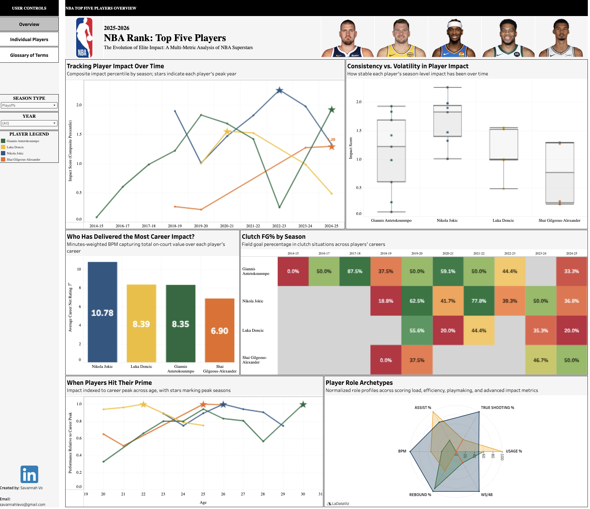
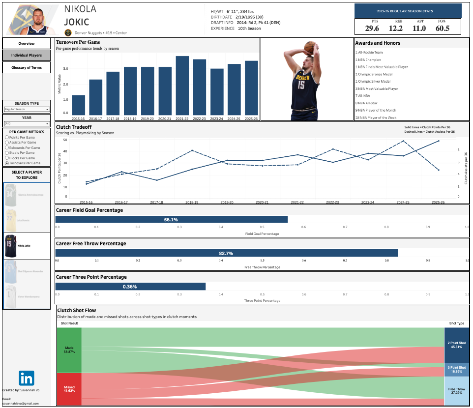

# NBA Player Impact Analysis

## Overview
When is an NBA player truly at their peak? This project analyzes the career trajectories of the top 5 NBA players from the [2025 ESPN rankings](https://www.espn.com/nba/story/_/id/46306892/nba-rank-2025-rankings-top-10-players-jokic-durant-lebron), posted on September of 2025 (Nikola Jokić, Shai Gilgeous-Alexander, Luka Dončić, Giannis Antetokounmpo, and Victor Wembanyama).

The goal was to quantify impact beyond basic box scores and visualize how these superstars transitioned their roles (e.g., from scorers to facilitators) to maintain elite efficiency.

[Multi-Metric Analysis of the Top 5 NBA Players Dashboard](https://public.tableau.com/app/profile/savannah.vo4280/viz/Top5NBAPlayers/IndividualPlayerAnalysis?publish=yes)

#### Features
* Implemented dashboard actions that allow for seamless transitions from the overview page, individual players, and glossary of terms
* Integrated global filters for Year and Season Type
* Developed a dynamic metric selector to toggle between Points, Assists, Rebounds, Steals, Blocks, and Turnovers Per Game on the individual players page
* Designed the view for the individual players page to allow for specific player selection
* Glossary of Terms page provides clear definitions of data used and complex custom features
   
---
## Key Insights
**Nikola Jokic's** role not only grew, but it fundamentally shifted. In 2015, his assist percentage was 18.1%. By 2025, it skyrocketed to 53.1%. He isn't just a "big man" who scores; he has become the primary player of the offense. He combines high basketball IQ, historic efficency, and playmaking ability in a way the league has never seen from a center. His value only increases in the playoffs (PPG jumps from 22.6 to 27.8), where his production, efficiency, and decision-making remain dominant against the highest level of competition. Unlike most superstars who rely on athleticism, Jokic dictates, pace, punishes every defense coverage, and leaves no exploitable weanesses, making him the most reliable and impactful player in basketball.

**Shai Gilgeous-Alexander** demonstrated the highest scalability, increasing his usage rate by 15% without a drop in True Shooting Percentage. While most NBA superstars see a significant drop in shooting percentage during clutch time (typically 6-7%), SGA has the smallest drop-off compared to the other four players. SGA scores efficiency on high usage, protects the ball, and consistently closes games. He creates offense regardless of scheme, matchup, or game flow. 

**Luka Doncic's** aveage scoring jumps from 29.25 PPG (Regular Season) to 31.5 PPG (Playoffs). It seems he not only plays more, but carries a significantly heavier burden of the team's entire offense. He consistently handles massive usage without losing effectiveness. In the 2023-24 season, he achieved a career-high of 33.9 PPG while simultaneously recording his best True Shooting Percentage (61.7%). Usually, as volume in PPG goes up, efficiency typically goes down. 

**Giannis Antetokounmpo** has a rare blend of size, speed, and strength. He puts constant rim pressure on defenses, forcing rotations, drawing fouls, and generating high-efficiency offense simply by attacking downhill. His clutch FG% peaked at a staggering 87.5% in the 2017-18 playoffs and constantly sits above 50% in his prime. Additionally, he is also a great defensive player. Many players decrease their defensive effort as their scoring load increases, Giannis did the opposite. His Defensive Box Plus/Minus leaped from -0.1 (Rookie) to 4.1 during his MVP seasons. Even as his usage rate climbed over 35%, his defensive metrics were still high. 

**Victor Wembanyama** is the most exciting player because even though he's only been playing in the NBA for a few years, he is already breaking traditional models of how a young player's efficiency scales. In his rookie season (2023-24), he already posted a Defensive Box Plus/Minus of 3.3, which increaed to 3.9 by 2025-26. From 2023 to 2026, his usage rate stayed steady (~32%), but his true shooting percentage jumped from 56.5% to 61.9%. He is able to score anywhere on the floor and additionally defend and cover space no other player can. Victor Wembanyama's starting point is higher than the peak of many very good players and he could be someone who realistically redefine what "best player in the league" means. 

---
## Technical Stack & Methodology
* **Data Collection**: Python (`BeautifulSoup`, `requests`) used to web-scrape career-long advanced and per game statistics from [Basketball Reference](https://www.basketball-reference.com/). Career-long clutch statistics were collected manually on an excel sheet from the official [NBA](https://www.nba.com/) website.
* **Data Engineering**: Cleaned and normalized disparate datasets using `Pandas`. Created a custom Impact Score feature (sum of the Percentile Ranks of PER, Box Plus-Minus, and Win Shares) and Age Curve Index (scaled a player's annual PER against their career-high PER).
* **Visualization**: Developed a interactive Tableau dashboard to analyze the summary of top 5 NBA players along with an analysis on each player individually. 
